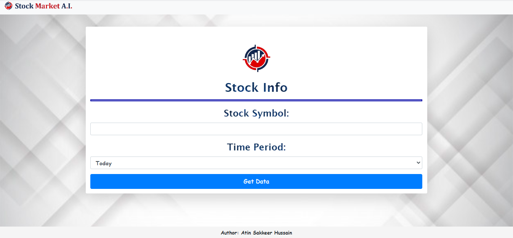
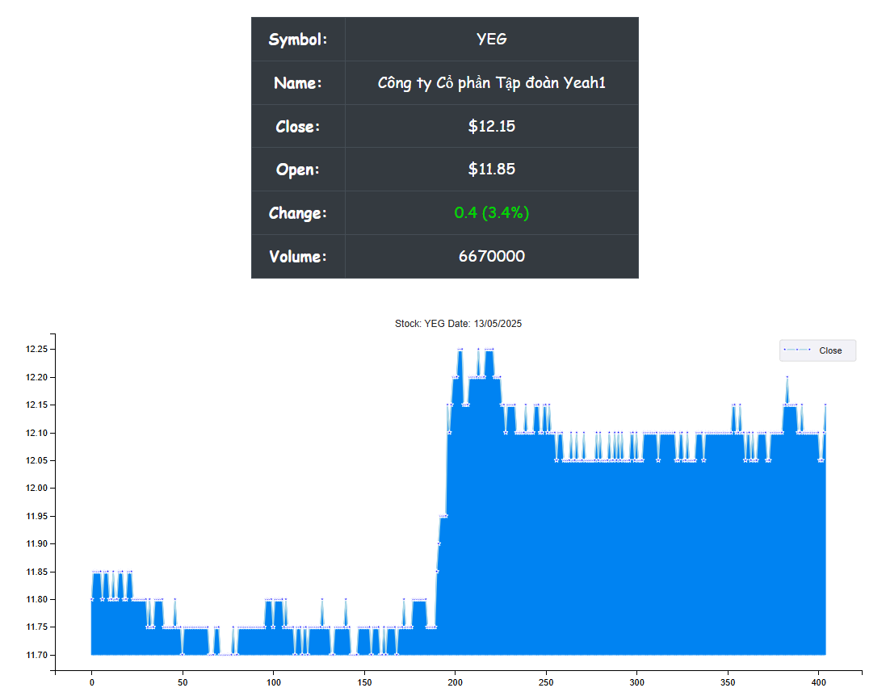
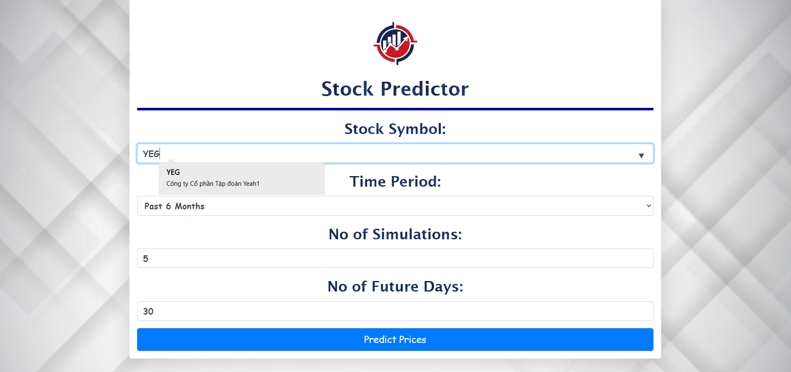
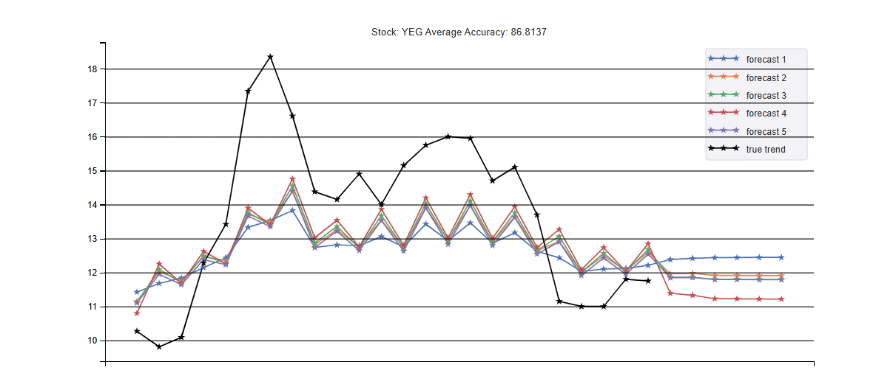
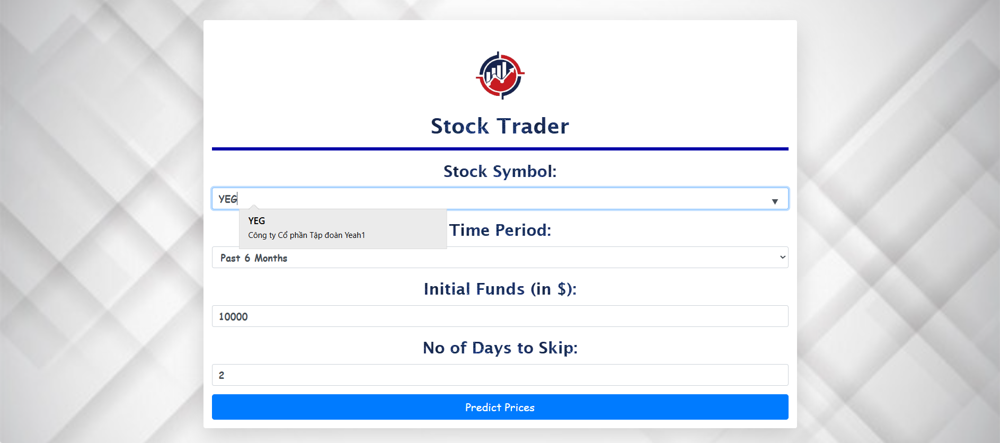
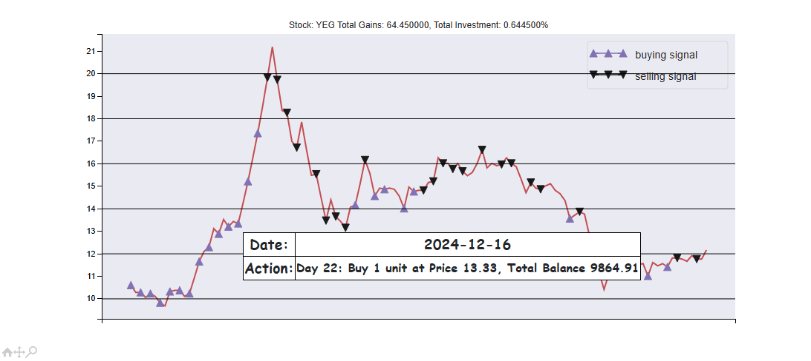

# Hướng dẫn cài đặt

## 

## Tạo môi trường ảo 
```
python -m venv .venv
```

## Kích hoạt môi trường ảo

```
.venv\Scripts\Activate
```

## Cài các thư viện cần thiết
```
pip install -r requirements.txt
```

## Khởi động máy chủ
```
python manage.py runserver
```

Trang chủ có 3 lựa chọn:

### 1. Stock Info
<p align="center">
  </p>
Just Input the Symbol of the Stock and the Duration for which to get the data and the data is fetched using the yahoo-finance library and graphed using matplotlib and mpld3.
<p align="center">
  </p>
The details are shown in the table and the closing prices are graphed. Hover your mouse over the points will give you a tooltip with the date and the closing price for that day.

### 2. Prediction
<p align="center">
  </p>
For the prediction you have to input the Symbol for the Stock, the Period of Data to train with, The Number of Simulations to run, and the Number of Future Days to predict for.
<p align="center">
  </p>
The closing prices of the simulations that are deemed acceptable is graphed using matplotlib and mpld3. Hover your mouse over the points will give you a tooltip with the date and the closing price for that day.

### 3.Trading Agent
<p align="center">
  </p>
For the trading agent you have to input the Symbol for the Stock, the Period of Data to trade on, The Initial Fund, and the Number of Days to Skip in between selling or buying.
<p align="center">
  </p>
The closing prices is graphed and the selling and buying days are marked with their respective markers using matplotlib and mpld3. Hover your mouse over the marker to get the date and the action done on that day.
